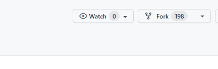
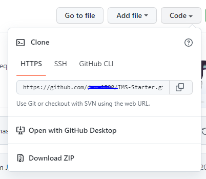
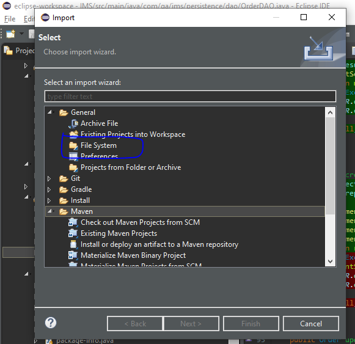

Coverage: 70%
# Project Title

This project was made with the sole purpose to manage an inventory system using Java and a database framework called Java Database Connectivity (JDBC). This program follows CRUD operations in creating, reading, updating and deleting onto and from a database. Using JDBC the project was able to follow CRUD operations and was able to successfully run and work as intended. Other technologies are also implemented and used, this being Maven which is a automation tool and is used for dependancy management, JUnit testing was implemented as a dependency with Maven to allow the implementation of unit testing, and finally, mockito is also added for the use of integration testing. The main goal of this project was to procure database data and is then printed out for the user via a Command line interface (CLI) in the programming IDE which in this case is Eclipse.

## Getting Started

These instructions will get you a copy of the project up and running on your local machine for development and testing purposes. See deployment for notes on how to deploy the project on a live system.

### Prerequisites

What things you need to install the software and how to install them

Maven is required for the use of unit testing and integration testing.
JUnit is used for unit testing, is a unit testing framework, used in a pom file as a dependancy on maven.<br />
Mockito is used for integration testing, is a mocking framework for java for unit testing also. Used in a pom file as a dependancy on maven. <br />
Eclipse for IDE or any other Java compatible IDE. Can be installed from their official sites Eclipse, intelliJ etc. <br />
MySQL is installed for the use of a database, can be installed by mySQL official site. <br />


### Installing

A step by step series of examples that tell you how to get a development env running

Say what the step will be

This project was installed by forking the original repository where this project is located.

<br />
Once forked you must clone it onto your system, or git pull (User's choice) Using git bash with these two commands: <br />
git clone "git url" into a directory of your choice.
You can create a remote in a directory using git remote add "name" "url" and then use git pull "(remote name)" "(branch name)".

<br />
Maven must be installed to be able to use dependencies this being mockito, JDBC and JUnit.
<br />
Using the IDE you prefer, import the project onto it by clicking on file > import > file system (on Eclipse), since it is a maven project, it automatically imports as a maven project.

<br />
Any dependencies that were used for the skeleton are also imported.
<br />
User can update dependencies with new versions if they choose to do so.
<br />

## Running the tests

Explain how to run the automated tests for this system. Break down into which tests and what they do
<br />
There were two tests that were undertaken, Unit testing and integration testing.
<br />
Unit testing is a form of testing to test small pieces of code, mainly being variables and constructors to check if they are fit to use. This happens by checking a small piece of code is delivering the expected outcome the developer is trying procure. 
<br />
Integration testing is integrating the modules into a group and are testing. Similar to unit testing but without testing smaller code, its a combined set hence being fit for code that is integrated into different methods and is used to check if the method is fit for use.

### Unit Tests 
<br />
Key Words: <br />
assertEquals: checks if the two values are equal, a boolean function using the == operation
<br />
assertTrue: checks if the expression is true.
<br />
assertFalse: checks if the expression is false.
<br />
)<br />
<br />
This test here is created for the sole purpose to test the create function for customer. These lines of code is to check if each parameter is correctly recognised and returns that result when ran. assertEquals is used to check if the object is equal 
<br />
<br />
)<br />
<br />
This image shows 6 tests being ran and all resulting in successful for the customersDAOTest which informs the developer that the methods in the customerDAO class are working as intended.
<br />
)<br />
<br />
The setup method is known as a before method and is ran before the tests are ran, this is to ensure the resources for the test are ran and stored beforehand for a successful test, as these tests require a schema, the setup method allows a testing schema to be used which is defined in a sql file that this application reads in text.
<br />
The first test is similar to the one above and is to check if the object returns the same as running the constructor for the item parameters.
<br />
The second test is to check if the readall method is working in itemsDAO. assertEquals checks if the if the list contains this result set and this specific resultset. As the setup contains an sql data file, this file contains a single query to add these parameters on setup, hence having an item stored on set up and then checking if the method to read all, is able to obtain this particular result. If this sql data file did not exist, the test would also include creating an item in the method before reading it as the read all is null before the setup and is only updated when the query is also set up before the test.
<br />
)<br />
<br />
This final image for unit testing shows that the itemDAOTest resulting in 100% successful for all 6 tests. Proving that the class is successful in its intended purpose.

### Integration Tests 
<br />
Key Words:<br />
assertEquals: checks if the two values are equal, a boolean function using the == operation
<br />
Mockito.when: This function checks to see when something happens, it will return this. an example would be when the key is inserted and twisted, the car should sputter etc.
<br />
Mockito.verify: checks invocations for a particular parameter/method thus if a method uses 3 long parameters when ran, it should be verified as 3 long invocations.
<br />
)<br />
<br />
These two intergration tests check the integration of creating an order, and the integration of reading an order.
<br />
The first test which is creating an order calls an order constructor with 3 variables being the order id, customer id and item id. Mockito when is then used to check when the user input is recognised for the first input, it should return the orderID, second input should return 1L and the same for the third input.
<br />
assertEquals is used to check if the order successfully returns the same result as the constructor, if so the test is successful else it will return an assertion error with the reason which most of the time it will be null.
<br />
)<br />
<br />
This final image shows the results of the integration testing for the order controller test and resulted in a successful test overall with  5/5 tests.


```
Give an example
```

## Deployment

Add additional notes about how to deploy this on a live system

## Built With

* [Maven](https://maven.apache.org/) - Dependency Management

## Versioning

We use [SemVer](http://semver.org/) for versioning.

## Authors

* **Chris Perrins** - *Initial work* - [christophperrins](https://github.com/christophperrins)

## License

This project is licensed under the MIT license - see the [LICENSE.md](LICENSE.md) file for details 

*For help in [Choosing a license](https://choosealicense.com/)*

## Acknowledgments

* Hat tip to anyone whose code was used
* Inspiration
* etc
